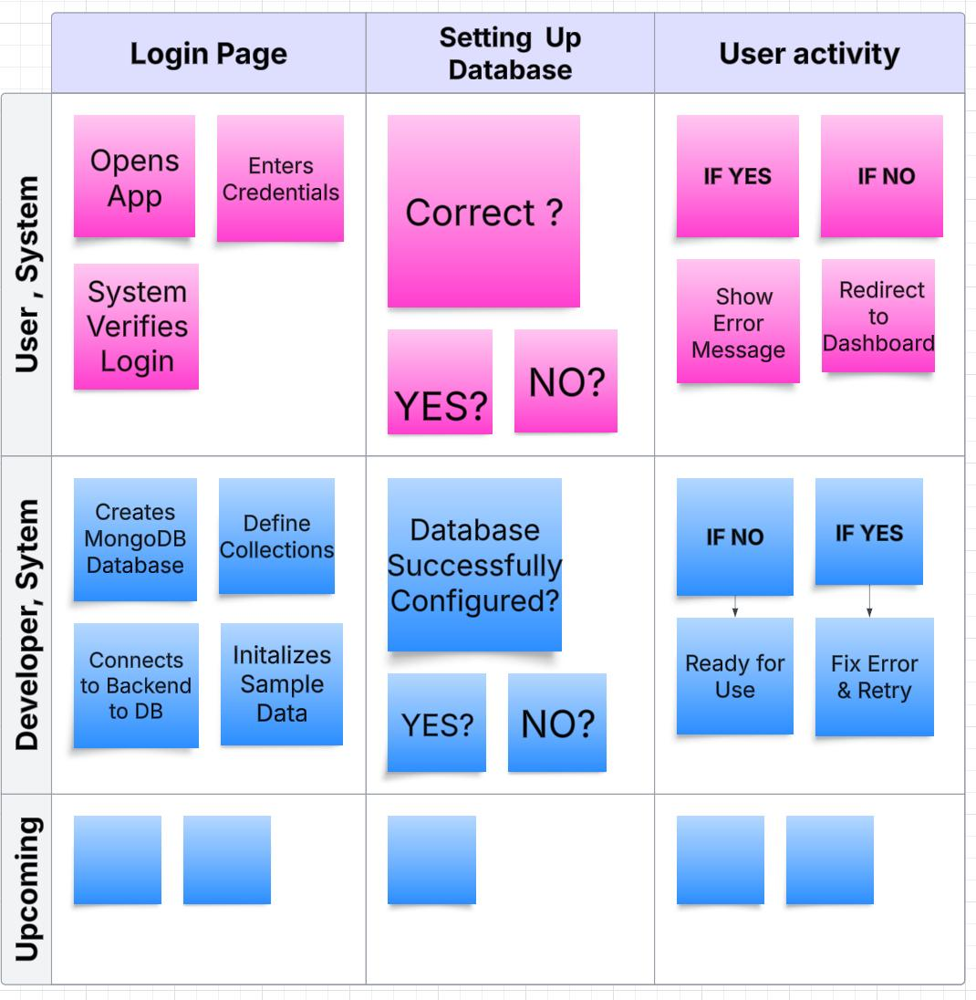
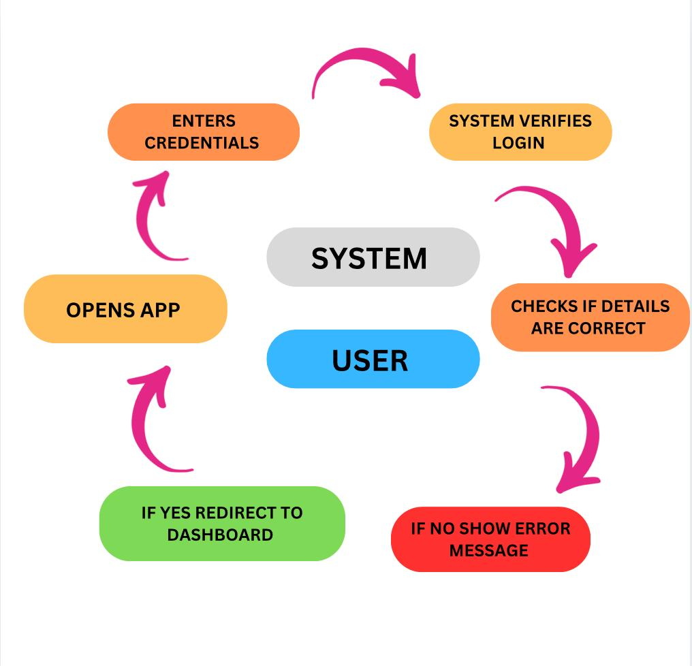
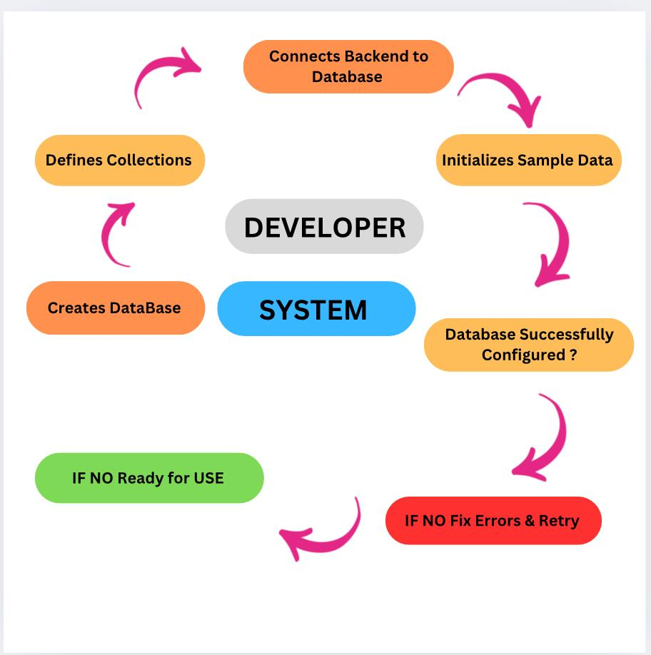

## Sprint 1

1. User Stories

2. User Flow Charts

2. What issues your team planned to address.
🖥️ Landing Page Setup
🔑 Login & Register Page and Authentication
📖 About Us Page
💾 Database Setup & Storage

3. Which ones were successfully complete
✅ Landing Page Setup
✅ Login & Register Page
✅ About Us Page
✅ Database Setup

4. Which ones didn't and why?
❌ Authentication Setup:
Authentication for login and registration wasn’t set up yet due to integration issues with third-party services and incomplete user validation logic. We are working on refining these processes for a secure setup.
❌ Storage Setup:
The database was set up successfully, but we are currently using local storage for testing. The transition to cloud storage is delayed due to pending configurations and permissions with the cloud service provider. We're actively working to resolve this!

## Members
- [DODDI SURAJ-BACKEND](https://github.com/SurajDoddi)
- [Umesh Chandra Lavu-BACKEND](https://github.com/LumeshC)
- [Kundana Sree Sankalpa Gullipalli - Front end](https://github.com/Kundanakushi)
- [Charchika Mishra- Front end](https://github.com/Charchika03)